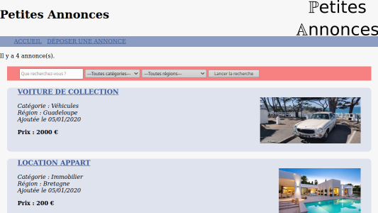

# PetitesAnnonces for YunoHost

[](https://dash.yunohost.org/appci/app/petitesannonces)  
[](https://install-app.yunohost.org/?app=petitesannonces)

*[Lire ce readme en français.](./README_fr.md)*

> *This package allow you to install PetitesAnnonces quickly and simply on a YunoHost server.  
If you don't have YunoHost, please see [here](https://yunohost.org/#/install) to know how to install and enjoy it.*

## Overview

Make your own classified advertising website easily.

**Shipped version:** 0.1.0

## Screenshots



<!-- 
## Demo

* [Official demo](Link to a demo site for this app)

## Configuration

How to configure this app: by an admin panel, a plain file with SSH, or any other way.

-->

## Documentation

 * Official documentation: https://framagit.org/anto1ne/petitesannonces  
 * YunoHost documentation: If specific documentation is needed, feel free to contribute.

## YunoHost specific features

#### Multi-users support

Are LDAP and HTTP auth supported? : No  
Can the app be used by multiple users? : No  

#### Supported architectures

* x86-64b - [](https://ci-apps.yunohost.org/ci/apps/petitesannonces/)
* ARMv8-A - [](https://ci-apps-arm.yunohost.org/ci/apps/petitesannonces/)

## Limitations

* Any known limitations : young application, still in developpment.

## Additional information

* Other information you would add about this application

**More information on the documentation page:**  
https://yunohost.org/packaging_apps

## Links

 * Report a bug: https://github.com/YunoHost-Apps/petitesannonces_ynh/issues
 * App website: https://framagit.org/anto1ne/petitesannonces  
 * Upstream app repository: https://framagit.org/anto1ne/petitesannonces  
 * YunoHost website: https://yunohost.org/

---

Developers info
----------------

**Only if you want to use a testing branch for coding, instead of merging directly into master.**
Please do your pull request to the [testing branch](https://github.com/YunoHost-Apps/petitesannonces_ynh/tree/testing).

To try the testing branch, please proceed like that.
```
sudo yunohost app install https://github.com/YunoHost-Apps/petitesannonces_ynh/tree/testing --debug
or
sudo yunohost app upgrade petitesannonces -u https://github.com/YunoHost-Apps/petitesannonces_ynh/tree/testing --debug
```
